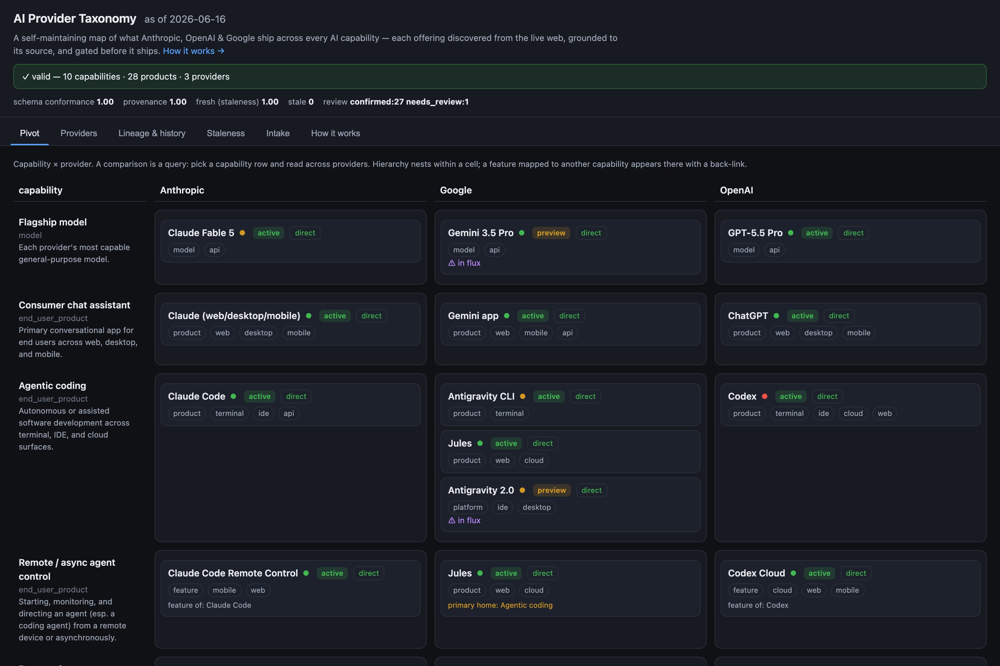
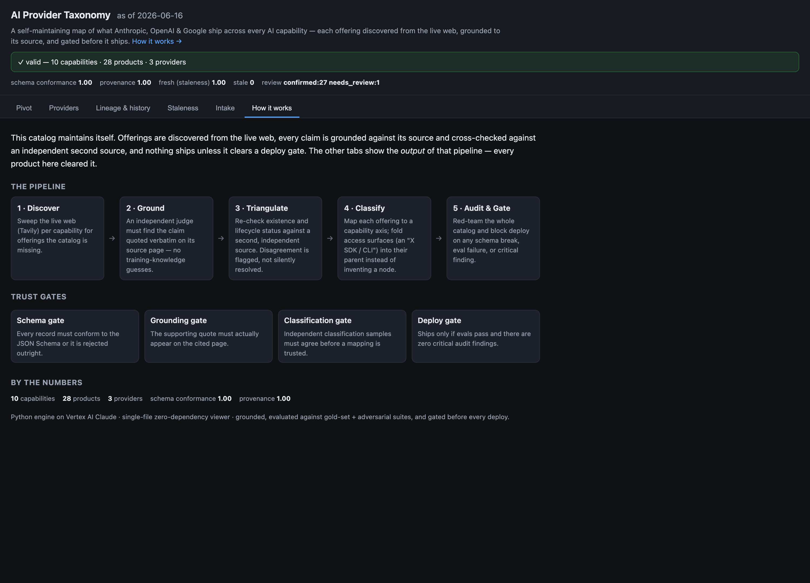

# AI Provider Taxonomy

**A self-maintaining catalog of what Anthropic, OpenAI & Google ship across every AI capability** — each offering discovered from the live web, grounded to its source, cross-checked against an independent second source, and gated before it ships.

🔗 **Live demo:** https://provider-seed-viewer-240942176969.us-east5.run.app



The hard part of a catalog like this isn't *displaying* the data — it's keeping it **true** while the ecosystem changes weekly. This repo is an engine that maintains the catalog itself (discover → ground → triangulate → classify → audit → gate) plus a single-file viewer that renders the result. Architecture first, then how to run it, then the data model that makes it work.

## Why it's interesting

- **It maintains itself.** A discovery pipeline sweeps the live web per capability, an LLM triages each find, and only records that clear quantitative trust gates are admitted — no hand-curation in the loop.
- **Every claim is grounded.** A record is admitted only if an independent judge finds the claim quoted *verbatim* on its cited page, then a **second, independent** source confirms existence and lifecycle status. Disagreement is surfaced, not silently resolved.
- **A deploy gate, not vibes.** The whole catalog is red-teamed before publish; any schema break, eval regression, or critical finding blocks the deploy.
- **Capability-anchored model.** Products churn; capabilities don't. A "comparison" is a *query* over a stable spine, not stored data — so a rename touches one field and the taxonomy holds.
- **Zero-dependency viewer.** One self-contained HTML file (no framework, no build step beyond data injection): capability pivot, provider drill-down, rename/sunset lineage, staleness queue, discovery intake, and an in-app "How it works".

## Architecture



```
 live web ──▶ Discover ──▶ Ground ──▶ Triangulate ──▶ Classify ──▶ Audit + Gate ──▶ publish
              (Tavily      (quote     (2nd indep.     (map to       (red-team;
               sweep)       on page)   source)         capability)   block ship)
                              │             │                            │
                         rejected if   flagged if                 blocked on schema /
                        quote missing  sources disagree           eval / critical finding
```

Each candidate passes **three trust gates** before it's admitted:

- **Schema gate** — conforms to `schema.json` + referential integrity, or it's rejected outright.
- **Grounding gate** — an independent judge's supporting quote must actually appear on the *fetched* source page. The judge is told the current date is past its training cutoff, so it grounds on the page, not on a stale prior — this is what stops it rejecting real-but-unfamiliar 2026 offerings, or hallucinating ones that don't exist.
- **Classification gate** — the capability mapping must be stable across N independent samples.

Above the bar → `confirmed`; partial → `needs_review`; ungrounded → `rejected` (never admitted). A separate **audit critic** then triangulates the finished catalog against independent sources, and a **deploy gate** blocks publish on any schema break, eval regression, or critical finding.

Built on **Vertex AI Claude** (`claude-opus-4-8`). Offline-first: the whole pipeline runs deterministically against fixtures with a stub LLM, behind **77 automated tests** plus gold-set and adversarial evals — no credentials needed to develop or test.

## Running it

### Offline (no GCP credentials) — runs against fixtures with a stub LLM

```sh
python3 -m taxonomy.cli validate    # validate the dataset (schema + referential integrity)
python3 -m taxonomy.cli discover agentic-coding   # sweep providers → candidate records
python3 -m taxonomy.cli triage      # run reviewable records through the trust gates → data/proposed.json
python3 -m taxonomy.cli audit       # red-team the catalog (schema · triangulation · completeness)
python3 -m taxonomy.cli eval        # gold-set + adversarial evals; appends ops/metrics.jsonl
python3 -m taxonomy.cli build       # generate viewer/taxonomy.html  (open in a browser)
python3 tests/run_all.py            # full test suite (no pytest needed)
```

### Going live (Vertex AI Claude)

```sh
pip install -e '.[vertex]'
gcloud auth application-default login
gcloud auth application-default set-quota-project <your-project-id>
cp .env.example .env.local          # set ANTHROPIC_VERTEX_PROJECT_ID, CLOUD_ML_REGION, VERTEX_MODEL
TAXO_OFFLINE=0 python3 -m taxonomy.cli ping                       # expect → 'pong'
TAXO_OFFLINE=0 python3 -m taxonomy.cli autobuild --capabilities agentic-coding   # discover → ground → loop
TAXO_OFFLINE=0 python3 -m taxonomy.cli gate --dataset data/auto.json             # deploy gate (exit 1 = blocked)
```

Auth is keyless (ADC locally, Workload Identity Federation in CI) — there are no API keys or service-account files for cloud auth. On Vertex the engine fetches source URLs itself (no server-side `web_fetch`), so the grounding gate is fully auditable. Optional: a [Tavily](https://tavily.com) key (`TAVILY_API_KEY` in `.env.local`) enables autonomous live-web discovery; without it, discovery is operator-seeded and grounding-fetch still runs in-engine.

## Layout

- `taxonomy/` — engine: `validate` · `discover` · `triage` · `trust` (the three gates) · `audit` (triangulation critic + deploy gate) · `autobuild` (loop-until-dry discovery) · `metrics`/`staleness` · `evals/` · `vertex_client` (Vertex + offline stub) · `retrieval/` (fixtures + httpx fetch + Tavily).
- `data/` — `taxonomy.json` (working store) · `fixtures/` (deterministic offline searches/pages/LLM responses).
- `viewer/` — `template.html` + `build.py` → `taxonomy.html` (capability pivot · provider drill-down · cross-provider equivalence · lineage/history · staleness · intake · how-it-works).
- `scripts/` — `ground.py` (rebuild the verified catalog) · `fill_gaps.py` (incremental gap-fill).
- `ops/` — run logs, eval-metrics time series, fetched-page cache (regenerable).

---

# The data model

The engine above is only as good as the schema it maintains. Two entity types — `capability` and `product` — defined in `schema.json`, with a hand-curated, fully-conformant seed in `examples.json`.

## The one idea that makes this work

**The capability is the anchor, not the product.**

Products are renamed, merged, and killed constantly. Functions ("agentic coding", "browser agent") are stable. So:

- `capabilities[]` = the stable taxonomy rows. They rarely change.
- `products[]` = concrete offerings, each pointing at one or more capabilities.

A "comparison" is then a **query**, not stored data: pick a capability, group its products by provider. This is what lets the app survive churn — when Google kills a product, you change one `status` field; the taxonomy rows never move.

## Why the comparison is never 1:1 (and how the schema absorbs it)

| Real-world mess | How the schema handles it |
|---|---|
| One provider's product maps to several of another's | Many `products` share one `capability_id`; the join is computed, not hard-coded. |
| A product is broader or narrower than the capability | `relation_within_capability`: `direct` / `partial` / `broader` / `none`. |
| A product spans multiple capabilities | `capability_ids` is an array; `primary_capability_id` picks the home row. |
| Products get renamed / merged / retired | `status` enum + `predecessor_id` / `successor_id` + dated `lifecycle[]`. |
| A provider deliberately offers nothing | An explicit `status: "absent"` record, so the UI shows a *sourced gap*, not a null. |
| The ecosystem changes faster than you can verify | `source.last_verified` + `source.confidence` drive staleness warnings. |
| A capability lives *inside* a product, not as its own product | `kind: "feature"` + `parent_id` pointing at the parent product. |
| Something new is discovered but not yet classified | `review_status: "candidate"` (optionally `primary_capability_id: "unclassified"`) until triage confirms it. |

## Granularity: model family → product → feature

The taxonomy holds offerings at any level using two fields: `kind` and `parent_id`.

- `kind` says what the node *is*: `model_family`, `model`, `product`, `feature`, `platform`, `protocol`, or `service_tier`.
- `parent_id` points at the node it belongs to: a `feature` → its `product`, a `model` → its `model_family`, a sub-product → its parent product.

This lets **Claude Code Remote Control** (a feature of Claude Code) or **Codex CLI** (a member of the Codex family) sit in the same dataset as top-level products and models without pretending they're standalone.

**When does a feature earn its own node?** Only when it represents a capability worth comparing across providers. Every product has dozens of small features; tracking them all is unbounded and useless. Remote Control earns a node because async/remote agent control is a real cross-provider axis (Google's Jules, OpenAI's Codex Cloud); a cosmetic toggle does not. **Rule of thumb: if it doesn't map to a capability another provider could also fill, it's a `scope_note`, not a node.** The engine enforces this automatically — an "X SDK / CLI" that merely exposes an already-listed product is folded into that product as an access surface rather than admitted as a new node.

## Discovery / intake lifecycle

The point of the design is that the catalog can *grow itself* as the ecosystem changes:

1. Discovery (live-web sweep, changelog scrape) finds a new product or feature.
2. It's written as a node with `review_status: "candidate"`, a `source.url`, and a best-guess `primary_capability_id` (or the reserved `unclassified` bucket if the capability isn't obvious).
3. Triage confirms the capability, sets `relation_within_capability`, runs the trust gates, and flips `review_status` to `confirmed` — or `rejected` (kept, not deleted, so it isn't rediscovered repeatedly).

## Origin

`schema.json` + `examples.json` were designed as **few-shot examples** to hand to a coding agent: a small, high-quality dataset whose every record demonstrates a specific edge case (rename lineage, scope mismatch, modeled absence, feature-inside-product, model-family hierarchy, discovery intake) so the agent infers the right data model and edge-case handling before writing code. The engine and viewer in this repo are what that seed grew into.
